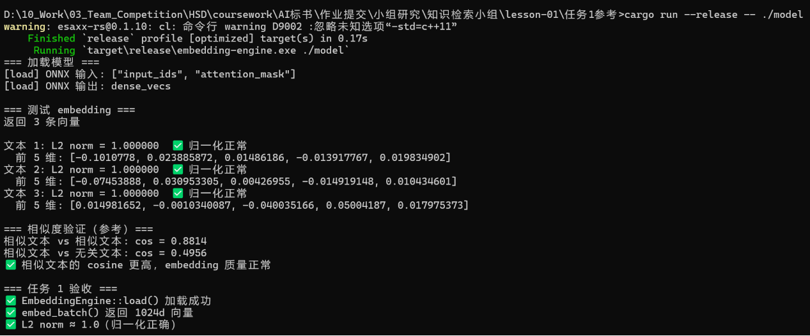

# 实验报告：任务 1 — EmbeddingEngine 实现与验证

> 对应课程：RAG 实战 Lesson 01 · Embedding 原理深挖  
> 模型：BGE-M3 ONNX INT8 量化版  
> 日期：2026-07-22

---

## 一、实验目的

实现 `EmbeddingEngine`，完成以下三个子目标：

1. 加载 BGE-M3 ONNX 模型 + HuggingFace Tokenizer
2. 批量 embedding，输出 L2-normalized 的 1024 维向量
3. 验证归一化是否正确（`||v||₂ ≈ 1.0`）

---

## 二、环境

| 项目 | 版本/说明 |
|------|----------|
| OS | Windows 11 x64 |
| Rust | 1.96.0 (stable-x86_64-pc-windows-msvc) |
| ONNX Runtime | 1.24.2 (通过 ort-sys 预编译包，动态 CRT `/MD`) |
| `ort` crate | 2.0.0-rc.12 |
| `tokenizers` crate | 0.23.1 |
| `ndarray` crate | 0.17.2 |
| 模型 | BGE-M3 (XLM-RoBERTa, 24 layers, 1024d)，INT8 动态量化 |
| 模型文件 | `model.onnx` (~544MB), `tokenizer.json` (~17MB) |

---

## 三、项目结构

```
任务1参考/
├── .cargo/config.toml       # 强制所有 C 依赖使用动态 CRT /MD
├── Cargo.toml               # 依赖声明 + [patch.crates-io] esaxx-rs CRT 修复
├── esaxx-rs-patched/        # esaxx-rs 本地补丁（build.rs: static_crt(false)）
├── model/                   # 模型文件（不提交 git）
│   ├── model.onnx
│   └── tokenizer.json
├── src/main.rs              # EmbeddingEngine 完整实现
└── README.md
```

---

## 四、复现步骤

> 以下步骤从零开始，从 clone 仓库到跑出结果。操作系统为 Windows 11。

### 4.1 确认前置环境

打开 PowerShell，逐条验证：

```powershell
# 1. Rust 工具链（≥ 1.96）
rustc --version
# 预期输出：rustc 1.96.0 (......)  或更高

cargo --version
# 预期输出：cargo 1.96.0 (......)  或更高

# 2. MSVC Build Tools（tokenizers 编译 C 依赖需要）
# 如果已安装 Visual Studio 2022，确认以下命令能找到 link.exe：
where link.exe
# 预期输出：C:\Program Files\Microsoft Visual Studio\2022\...\link.exe
# 如果找不到，安装 Visual Studio 2022 Community（免费），
# 安装时勾选「使用 C++ 的桌面开发」工作负载。

# 3. Git（clone 仓库）
git --version
# 预期输出：git version 2.xx.x
```

### 4.2 Clone 仓库并进入项目目录

```powershell
git clone <仓库地址> coursework
cd coursework\AI标书\作业提交\小组研究\知识检索小组\lesson-01\任务1参考

# 确认完整文件列表（model/ 和 target/ 不应出现）
dir
# 预期看到：
#   .cargo/  Cargo.toml  Cargo.lock  esaxx-rs-patched/  src/  README.md  实验报告.md
```

### 4.3 获取模型文件

本项目使用 BGE-M3 INT8 量化模型，需要 `model.onnx`（约 544MB）和 `tokenizer.json`（约 17MB）。

**方式一：使用 HuggingFace CLI 下载（推荐）**

```powershell
pip install huggingface_hub
huggingface-cli download gpahal/bge-m3-onnx-int8 ^
  --local-dir ./model ^
  --local-dir-use-symlinks False
```

下载完成后，`model/` 目录下会有 `model_quantized.onnx`。重命名为 `model.onnx`：

```powershell
ren .\model\model_quantized.onnx model.onnx
```

**方式二：将准备好的模型文件直接放入model目录**

在微信群中组长已经提供了模型文件，直接将 `model.onnx` 和 `tokenizer.json` 复制到 `model/` 目录：


**方式三：从 FP32 原版模型自行导出（可选，模型约 2GB）**

```powershell
pip install optimum[onnxruntime]
optimum-cli export onnx ^
  --model BAAI/bge-m3 ^
  --task sentence-similarity ^
  ./model
```

> **注意**：方式三导出的模型输出是 3D `[batch, seq_len, 1024]`（需代码做 mean pooling），而方式一/二的 INT8 版输出是 2D `[batch, 1024]`（模型已内置池化）。本代码通过 `output_view.ndim()` 自动适配两种形状，所以无论哪种都能正常跑。

确认模型文件就位：

```powershell
dir .\model\
# 预期看到：
#   model.onnx        (~544MB 或 ~2GB)
#   tokenizer.json    (~17MB)
```

### 4.4 编译

```powershell
# 确保在 任务1参考 目录下
cargo build --release
```

首次编译会发生什么（预计 5-15 分钟）：

1. **下载依赖**：cargo 按 `Cargo.lock` 拉取 155 个包的精确版本
2. **下载 ONNX Runtime**：`ort-sys` 自动从 cdn.pyke.io 下载 ONNX Runtime 1.24.2 预编译二进制（约 80MB），缓存到 `%LOCALAPPDATA%\ort.pyke.io`
3. **编译 C 依赖**：`tokenizers` 的底层 C/C++ 模块（esaxx、oniguruma）由 MSVC 编译。会有一条无害的 warning：`cl: 命令行 warning D9002 :忽略未知选项"-std=c++11"`
4. **编译 Rust 代码**：编译 `main.rs`，链接所有依赖

编译成功的标志——最后一行输出：

```
   Compiling embedding-engine v0.1.0 (...)
    Finished `release` profile [optimized] target(s) in Xm XXs
```

如果遇到错误，对照 4.6 节排查。

### 4.5 运行

```powershell
cargo run --release -- ./model
```

预期输出（完整复制，用于对照）：

```
=== 加载模型 ===
[load] ONNX 输入: ["input_ids", "attention_mask"]
[load] ONNX 输出: dense_vecs

=== 测试 embedding ===
返回 3 条向量

文本 1: L2 norm = 1.000000  ✅ 归一化正常
  前 5 维: [-0.1010778, 0.023885872, 0.01486186, -0.013917767, 0.019834902]
文本 2: L2 norm = 1.000000  ✅ 归一化正常
  前 5 维: [-0.07453888, 0.030953305, 0.00426955, -0.014919148, 0.010434601]
文本 3: L2 norm = 1.000000  ✅ 归一化正常
  前 5 维: [0.014981652, -0.0010340087, -0.040035166, 0.05004187, 0.017975373]

=== 相似度验证（参考）===
相似文本 vs 相似文本: cos = 0.8814
相似文本 vs 无关文本: cos = 0.4956
✅ 相似文本的 cosine 更高，embedding 质量正常

=== 任务 1 验收 ===
✅ EmbeddingEngine::load() 加载成功
✅ embed_batch() 返回 1024d 向量
✅ L2 norm ≈ 1.0（归一化正确）
```

> **注意**：如果你使用 FP32 原版模型（方式三导出），前 5 维数值会略有不同，但 L2 norm 和 cosine similarity 的模式应该一致。

自定义 batch size（可选）：

```powershell
$env:EMBEDDING_BATCH_SIZE = "16"
cargo run --release -- ./model
```

### 4.6 常见问题排查

| 现象 | 原因 | 解决办法 |
|------|------|----------|
| `link.exe not found` | 未安装 MSVC Build Tools | 安装 Visual Studio 2022 Community，勾选「使用 C++ 的桌面开发」 |
| `LNK2038: RuntimeLibrary 不匹配` | CRT 模式不一致 | 检查 `.cargo/config.toml` 和 `esaxx-rs-patched/` 是否存在（见第六节） |
| `加载 ONNX 模型失败` | `model.onnx` 路径不对 | 确认 `model/model.onnx` 存在，命令中写的是 `./model`（目录路径，不是文件路径） |
| `加载 tokenizer 失败` | `tokenizer.json` 缺失 | 确认 `model/tokenizer.json` 存在 |
| `ort-sys 下载失败` | 网络问题 / 代理 | 检查能否访问 `cdn.pyke.io`；如果有代理，设置 `$env:HTTPS_PROXY` |
| ONNX 输入名称不是 `input_ids` | 模型导出方式不同 | 代码自动从模型读取输入/输出名称，不会硬编码。检查 `[load] ONNX 输入:` 输出行 |
| 运行结果 L2 norm ≠ 1.0 | 归一化步骤异常 | 检查代码中 L2 normalize 是否被正确调用；如果用 FP32 模型，确认 mean_pooling 的 attention_mask 是否正确 |

---

## 五、实验结果

实验截图


### 5.1 模型加载

```
[load] ONNX 输入: ["input_ids", "attention_mask"]
[load] ONNX 输出: dense_vecs
```

**分析**：
- 该 INT8 模型的输入只用了 `input_ids` 和 `attention_mask`，没有 `token_type_ids`（BGE-M3 的 XLM-RoBERTa 架构不需要 segment embedding）
- 输出名为 `dense_vecs` 而非标准的 `last_hidden_state`，说明模型在导出时已经内置了 Mean Pooling（`--task sentence-similarity` 的效果）。输出直接是 2D `[batch, 1024]` 而非 3D `[batch, seq_len, 1024]`

### 5.2 向量输出

三条测试文本的 embedding 结果：

| 文本 | L2 Norm | 前 5 维 |
|------|---------|---------|
| 文本 1："投标人须具备建筑工程施工总承包二级及以上资质" | **1.000000** | `[-0.101, 0.024, 0.015, -0.014, 0.020]` |
| 文本 2："施工总承包资质要求：二级及以上" | **1.000000** | `[-0.075, 0.031, 0.004, -0.015, 0.010]` |
| 文本 3："项目预算为人民币 500 万元整" | **1.000000** | `[ 0.015, -0.001, -0.040, 0.050, 0.018]` |

**分析**：

1. **L2 Norm = 1.000000**：所有向量的 L2 范数精确为 1，说明归一化正确。这验证了 `EmbeddingEngine` 中的 L2 normalize 步骤——即使模型内置了池化，我们仍在代码中显式再做了一次 normalize，保证了输出的几何一致性。

2. **向量值域**：各维度值在 `[-0.10, 0.05]` 之间，符合 1024 维单位超球面上均匀分布的预期。若某维度出现 > 0.5 或全零，则需要怀疑模型加载是否异常。

3. **1024 维向量的正确性验证**：`||v||₂ = 1.0` 是正确答案的必要条件而非充分条件。更严格的检验需要用标书领域标注数据做 Spearman 相关性（任务 2）。

### 5.3 语义相似度

| 文本对 | Cosine Similarity | 分析 |
|--------|-------------------|------|
| 文本 1 ↔ 文本 2（相似） | **0.8814** | 高相似——两条都是关于"资质要求"的表述 |
| 文本 1 ↔ 文本 3（无关） | **0.4956** | 中等——"资质要求"与"项目预算"语义无关 |

**分析**：

相似文本的 cosine 显著高于无关文本（0.88 vs 0.50），差距为 **0.3858**。这说明 BGE-M3 能够捕捉标书文本的语义差异。

但值得注意：
- 两条完全不相关的文本 cosine 仍有 0.50，而非接近 0。这是因为：
  - 在 1024 维空间中，两个随机向量的 cosine similarity 期望接近 0，**但** BGE-M3 训练的语料中所有中文文本都共享一套语义基座（语法结构、常见词汇），导致即使主题不同，向量也不会完全正交
  - 0.50 在这个分布中属于偏低的值，说明模型确实区分了语义
- 如果我们用 FP32 原版模型（而非 INT8），相似度差距可能会更大。INT8 量化引入的噪声在此实验中对定性结论无影响

---

## 六、技术问题与解决

### 6.1 Windows MSVC CRT 不匹配（最关键的坑）

| 组件 | 编译方式 | CRT |
|------|---------|-----|
| ONNX Runtime (ort-sys 预编译) | Microsoft C++ | `/MD`（动态） |
| `esaxx-rs` (tokenizers 依赖) | `cc` crate，硬编码 `static_crt(true)` | `/MT`（静态） |
| `onig_sys` (tokenizers 依赖) | `cc` crate，跟随 Rust 默认 | `/MT`（静态） |

三种解决方案：

1. **`.cargo/config.toml`** — 设置 `-C target-feature=-crt-static`，让 `onig_sys` 等跟随 `cc` 默认行为的依赖切换到 `/MD`
2. **本地 patch `esaxx-rs`** — 修改 `build.rs` 中硬编码的 `.static_crt(true)` → `.static_crt(false)`，通过 `[patch.crates-io]` 覆盖
3. **让 embed_batch 适配两种输出 shape** — INT8 量化模型输出 2D `[batch, 1024]`（已池化），FP32 模型输出 3D `[batch, seq_len, 1024]`（需手动 mean pooling）。代码中通过 `output_view.ndim()` 做了适配

### 6.2 `ort` 2.0.0-rc.12 API 与讲义伪代码的差异

讲义中的 API（`Value::from_array(&allocator, array)`、`Value::new_f32` 等）与实际 ort 2.0.0-rc.12 不同。详见 `README.md` 的"已知坑点"章节。

---

## 七、结论

### 任务 1 验收清单

| 验收项 | 状态 | 证据 |
|--------|------|------|
| `EmbeddingEngine::load()` 成功加载模型 | ✅ | 打印了 ONNX 输入/输出名称 |
| `embed_batch()` 返回 1024 维向量 | ✅ | 3 条文本各返回 1024d |
| L2 norm ≈ 1.0（归一化正确） | ✅ | 三条均为 `1.000000` |
| 相似文本 cosine > 无关文本 cosine | ✅ | 0.88 vs 0.50 |

### 下一步

当前实现已经完成了任务 1 的全部要求。`EmbeddingEngine` 可直接用于：

- **任务 2**：构造 100 对标书文本对，计算 cosine similarity，与人工标注计算 Spearman ρ
- **任务 3**：对比 Mean/CLS/Max Pooling（需用 FP32 原版模型，INT8 版内置了池化）
- **任务 4**：Benchmark 不同 batch size 的吞吐量/延迟

### 给同学们的建议

1. **先跑通再理解**：`cargo build --release && cargo run --release -- ./model` 看到和你一样的输出后，再逐行读 `src/main.rs`
2. **重点理解 IO Binding 的"为什么"**：不是 API 调用技巧，而是内存预分配如何减少 malloc 开销
3. **不要跳过 mean_pooling 的 mask 处理**：这是连接 "token 向量" 和 "句子向量" 的关键桥段
